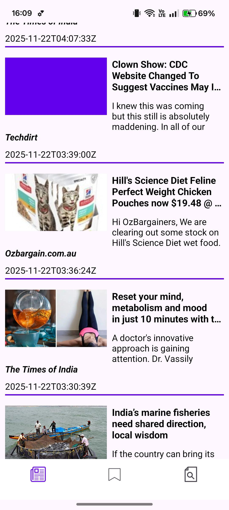
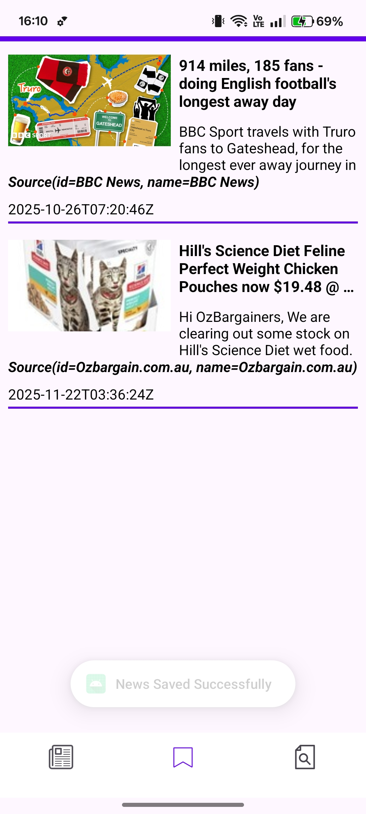

This News App allows users to stay updated with the latest headlines from around the world. Users can browse breaking news, search for news on any topic, and explore articles from different categories such as sports, technology, health, business, and more. Each article includes a detailed page where users can read the full content through a built-in WebView.

Users can also save their favorite articles using a heart button, and view or remove them later from the saved news section. The app supports smooth scrolling with Paging 3, modern UI, and fast loading through Retrofit and Room Database.

⭐ Key Features
✔ Breaking News

Get the latest top headlines instantly.

✔ Search Any Topic

Find news articles on any subject using the search feature.

✔ Category-wise Browsing

Explore Sports, Tech, Entertainment, Health, Business, and more.

✔ Save Favorite Articles

Bookmark news with a heart button and revisit them anytime.

✔ Read in WebView

Open full articles inside the app for a seamless reading experience.

✔ Paging 3 Support

Pagination ensures smooth and fast scrolling without lag.

✔ Offline Saving (Room Database)

Saved articles remain available even when offline.

This app provides a clean, simple, and user-friendly way to stay updated with global news.

 

  
  
  
  

